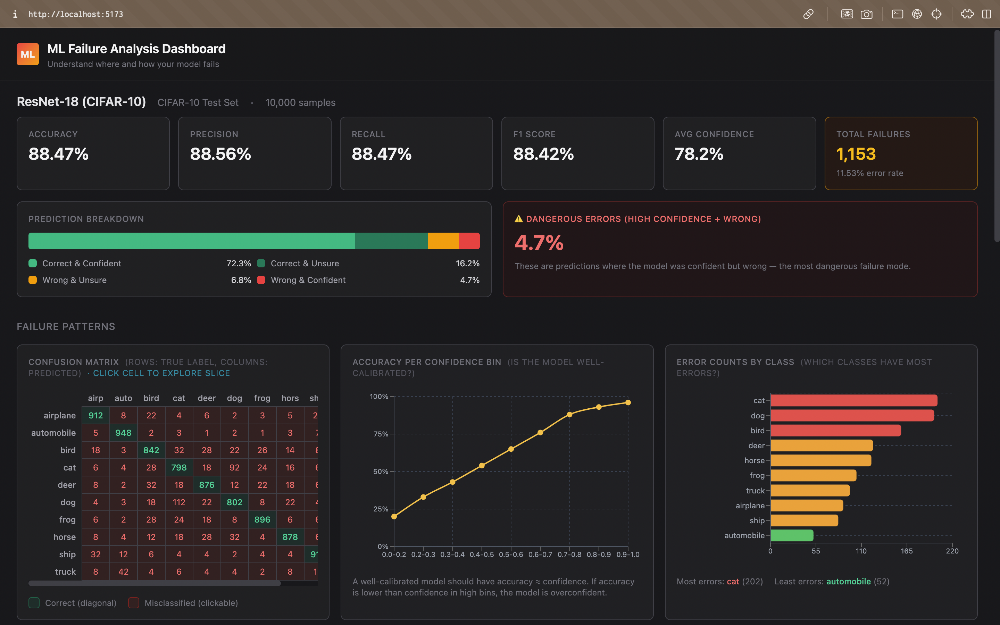
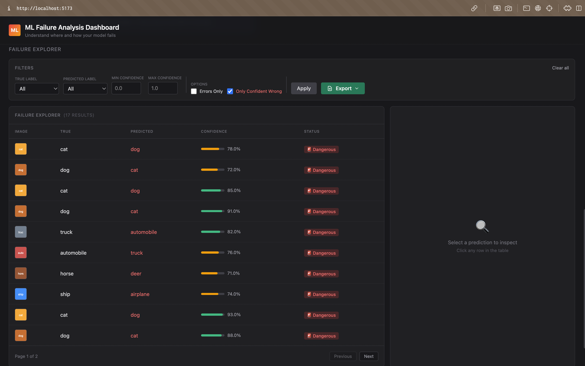
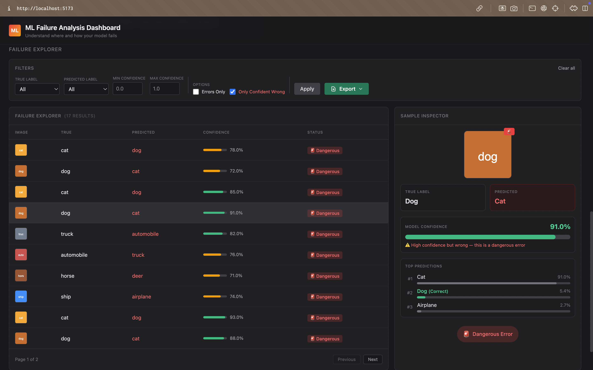
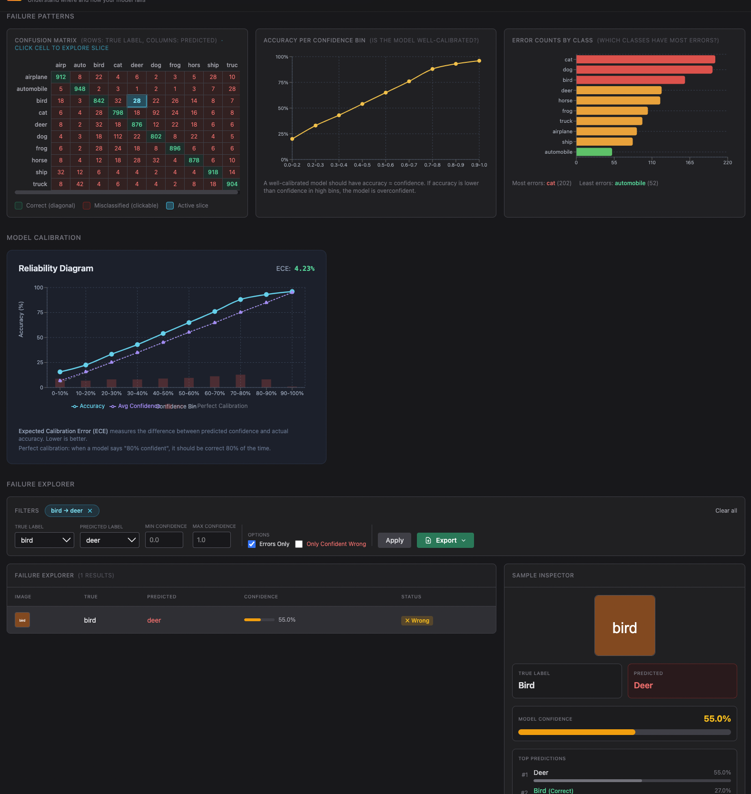

# ML Failure Analysis Dashboard

> **Live Demo:** https://ml-failure-dashboard.vercel.app (uses mock data)

A dashboard for analyzing ML model failures, with a focus on identifying dangerous high-confidence errors. Built with React + TypeScript (frontend) and FastAPI (backend).

**Full backend with real CIFAR-10 evaluation available locally** (see Quick Start below).

## 🎯 What to Look At

This dashboard's killer feature: **finding high-confidence wrong predictions** — the most dangerous errors in production.

### Screenshot 1: Overview + Confusion Matrix

- Model achieves ~88% accuracy on CIFAR-10
- **4.7% of predictions are high-confidence but wrong** (the red danger zone)
- Confusion matrix shows cat↔dog and automobile↔truck are major confusion pairs

### Screenshot 2: High Confidence Wrong Filter

- Click "Only Confident Wrong" checkbox to reveal the killer feature
- These are predictions where the model is ≥80% confident but completely wrong
- Notice the confidence scores: 0.85, 0.91, 0.93 — dangerously overconfident

### Screenshot 3: Sample Inspector

- Click any row to inspect in detail
- See the full top-3 predictions and confidence breakdown
- Actual image from CIFAR-10 test set shown

### Screenshot 4: Reliability Diagram + Slice Explorer

- **ECE (Expected Calibration Error)**: 4.23% — shows model is fairly well calibrated
- Click confusion matrix cells to explore specific error slices (e.g., "cat → dog")
- Export filtered predictions as CSV/JSONL for deeper analysis

---

## 🚀 Quick Start (Local Development)

### Option 1: Frontend Only (Mock Data)
```bash
cd frontend
npm install
npm run dev
```
Open http://localhost:5173 - uses mock data by default.

### Option 2: Full Stack (Real Backend)

**Terminal 1 - Backend:**
```bash
cd backend
python3 -m venv venv
source venv/bin/activate
pip install -r requirements.txt
uvicorn app.main:app --reload --port 8000
```

**Terminal 2 - Frontend:**
```bash
cd frontend
npm install
npm run dev
```

Then create `frontend/.env.local`:
```env
VITE_USE_MOCKS=false
VITE_API_BASE=http://localhost:8000
```

## 📦 Deployment

The live demo at https://ml-failure-dashboard.vercel.app uses mock data for demonstration purposes.

To deploy with real backend:
1. See [DEPLOYMENT.md](./DEPLOYMENT.md) for detailed instructions
2. Backend can be deployed to Railway, Render, or Fly.io
3. Frontend deployed to Vercel with backend URL as environment variable

## 🛠 Features

### Core
- **Model Overview** - Accuracy, precision, recall, F1, confidence breakdown
- **Confusion Matrix** - Clickable cells to explore error slices
- **Confidence Curve** - Accuracy vs confidence buckets
- **Errors by Class** - Bar chart of error distribution

### v2 Features
- **Reliability Diagram** - Model calibration with ECE (Expected Calibration Error)
- **Slice Explorer** - Click confusion matrix cells to filter to specific misclassifications
- **Export** - Download filtered predictions as CSV or JSONL
- **Overconfident Errors Toggle** - Highlight dangerous high-confidence mistakes

## 📁 Project Structure

```
ml-failure-dashboard/
├── frontend/                 # React + TypeScript + Vite
│   ├── src/
│   │   ├── api/             # API client & types
│   │   ├── components/      # React components
│   │   └── pages/           # Dashboard page
│   ├── vercel.json          # Vercel config
│   └── package.json
│
├── backend/                  # FastAPI
│   ├── app/
│   │   ├── api/routes.py    # API endpoints
│   │   ├── data/            # JSON artifacts
│   │   ├── models/          # Pydantic schemas
│   │   └── services/        # Data store & evaluator
│   └── requirements.txt
│
└── README.md
```

## 🔗 API Endpoints

| Endpoint | Description |
|----------|-------------|
| `GET /api/overview` | Model metrics & failure breakdown |
| `GET /api/confusion-matrix` | Confusion matrix data |
| `GET /api/confidence-curve` | Calibration curve data |
| `GET /api/errors-by-class` | Error distribution by class |
| `GET /api/predictions` | Paginated predictions with filters |
| `GET /api/predictions/{id}` | Single prediction by ID |
| `GET /api/calibration` | Reliability diagram data with ECE |
| `GET /api/export` | Export predictions as CSV or JSONL |

## 🧠 Generate Real Data (CIFAR-10)

**Before deploying, generate real evaluation artifacts:**

```bash
cd backend
source venv/bin/activate

# Install dependencies (if not done)
pip install -r requirements.txt

# Train model and generate artifacts (~5-10 minutes)
python -m app.services.evaluator --epochs 3 --seed 42
```

This will:
- ✅ Train a SimpleCNN on CIFAR-10 (reaches ~65-75% accuracy)
- ✅ Evaluate on 10,000 test images
- ✅ Generate all JSON artifacts in `app/data/`
- ✅ Save test images to `app/static/images/test/`
- ✅ Compute calibration (ECE) and reliability diagram data

**Note:** Use `--epochs 5` for better accuracy (~80%) but takes longer.

---

## 🎓 About This Project

This dashboard demonstrates:
- Full-stack development (React + FastAPI)
- ML/AI debugging and observability
- Production deployment (Vercel + Railway)
- Clean code architecture and documentation

**Tech Stack:**
- **Frontend:** React, TypeScript, Vite, TailwindCSS, Recharts
- **Backend:** FastAPI, Pydantic, PyTorch, scikit-learn
- **Deployment:** Vercel (frontend with mock data)

## 📝 License

MIT
